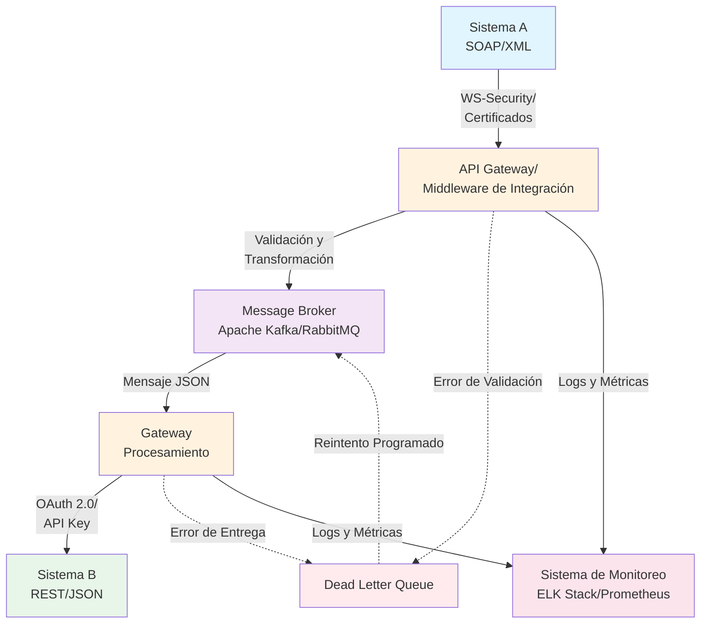
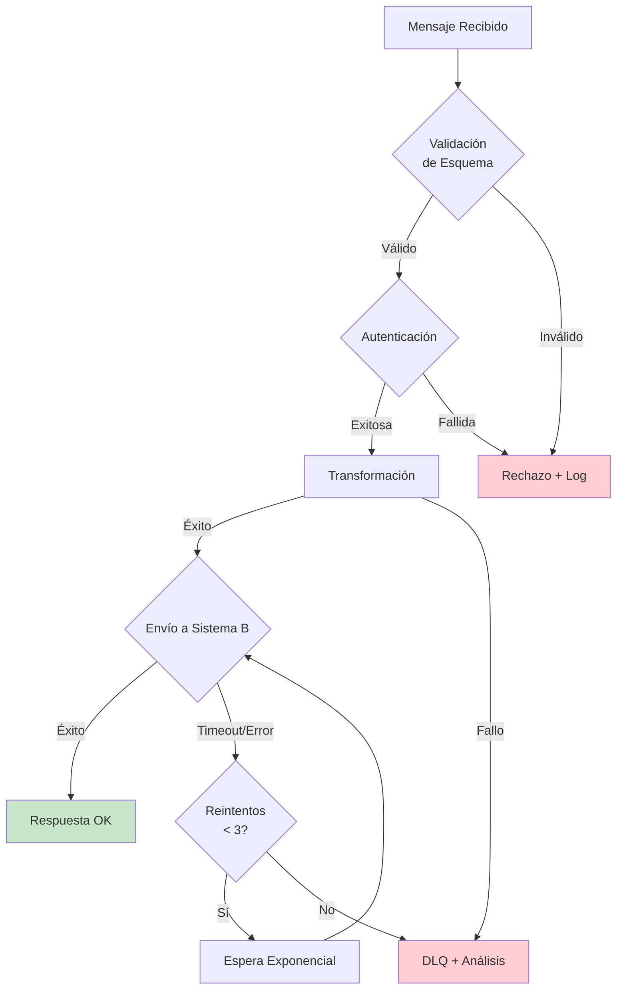

# Especificación de Integración: Sistema A (SOAP) a Sistema B (REST)

## Diagrama de Flujo de Alto Nivel



### Componentes del Flujo:

1. **Sistema A (Legado)**: Productor de mensajes SOAP/XML
2. **API Gateway/Middleware**: Punto central de transformación y validación
3. **Message Broker**: Desacoplamiento asíncrono y persistencia de mensajes
4. **Dead Letter Queue (DLQ)**: Gestión de mensajes fallidos
5. **Sistema B (Moderno)**: Consumidor REST/JSON
6. **Sistema de Monitoreo**: Observabilidad y trazabilidad

## Descripción de la Transformación (XML → JSON)

### Mapeo de Datos SOAP/XML a REST/JSON

#### Ejemplo de Mensaje SOAP de Entrada:
```xml
<soap:Envelope xmlns:soap="http://schemas.xmlsoap.org/soap/envelope/">
  <soap:Header>
    <auth:Authentication xmlns:auth="http://example.com/auth">
      <auth:Username>user123</auth:Username>
      <auth:Token>ABC123XYZ</auth:Token>
    </auth:Authentication>
  </soap:Header>
  <soap:Body>
    <ord:Order xmlns:ord="http://example.com/order">
      <ord:OrderId>ORD-2025-001</ord:OrderId>
      <ord:Customer>
        <ord:CustomerId>CUST-456</ord:CustomerId>
        <ord:Name>Juan Pérez</ord:Name>
        <ord:Email>juan@example.com</ord:Email>
      </ord:Customer>
      <ord:Items>
        <ord:Item>
          <ord:ProductId>PROD-789</ord:ProductId>
          <ord:Quantity>2</ord:Quantity>
          <ord:Price>150.50</ord:Price>
        </ord:Item>
      </ord:Items>
      <ord:TotalAmount>301.00</ord:TotalAmount>
      <ord:OrderDate>2025-10-04T10:30:00Z</ord:OrderDate>
    </ord:Order>
  </soap:Body>
</soap:Envelope>
```

#### Mensaje JSON de Salida:
```json
{
  "orderId": "ORD-2025-001",
  "customer": {
    "customerId": "CUST-456",
    "name": "Juan Pérez",
    "email": "juan@example.com"
  },
  "items": [
    {
      "productId": "PROD-789",
      "quantity": 2,
      "unitPrice": 150.50
    }
  ],
  "totalAmount": 301.00,
  "orderDate": "2025-10-04T10:30:00Z",
  "metadata": {
    "correlationId": "550e8400-e29b-41d4-a716-446655440000",
    "sourceSystem": "SOAP_LEGACY",
    "transformedAt": "2025-10-04T10:30:01Z"
  }
}
```

### Proceso de Transformación:

1. **Extracción del Body SOAP**: Se extrae el contenido del elemento `<soap:Body>`
2. **Eliminación de Namespaces**: Se remueven los prefijos XML (ord:, auth:)
3. **Conversión de Nomenclatura**:
   - XML: PascalCase (`OrderId`) → JSON: camelCase (`orderId`)
4. **Mapeo de Estructuras Anidadas**:
   - `<ord:Customer>` → `customer: { ... }`
   - `<ord:Items><ord:Item>` → `items: [ ... ]`
5. **Conversión de Tipos de Datos**:
   - Strings numéricos → Números (150.50)
   - Fechas ISO 8601 se mantienen como strings
   - Booleanos: "true"/"false" → true/false
6. **Enriquecimiento de Metadatos**:
   - Se añade `correlationId` para trazabilidad
   - Se registra `sourceSystem` y `transformedAt`

## Manejo de Errores Detallado

### Tipos de Errores y Estrategias de Manejo

| Tipo de Error | Descripción | Estrategia de Manejo | Acción |
|---------------|-------------|---------------------|--------|
| **Error de Conexión** | Fallo al conectar con Sistema A o B | Reintento exponencial (3 intentos) | Si falla → DLQ con alerta |
| **Error de Validación de Esquema** | XML/JSON no cumple con el schema | Validación temprana en Gateway | Rechazo inmediato + log detallado |
| **Error de Autenticación** | Credenciales inválidas o token expirado | Verificación de credenciales | Bloqueo + notificación de seguridad |
| **Error de Transformación** | Fallo en mapeo XML→JSON | Captura de excepción | Mensaje a DLQ + análisis manual |
| **Error de Timeout** | Sistema B no responde a tiempo | Timeout de 30s | Reintento (máx 3) → DLQ |
| **Error de Negocio** | Lógica de negocio rechaza la solicitud | Validación de reglas | Respuesta estructurada al Sistema A |

### Flujo de Manejo de Errores:



### Configuración de Reintentos:

- **Primer reintento**: 2 segundos
- **Segundo reintento**: 4 segundos
- **Tercer reintento**: 8 segundos
- **Después de 3 fallos**: Mensaje enviado a DLQ para revisión manual

### Dead Letter Queue (DLQ):

La DLQ almacena mensajes que no pudieron ser procesados después de todos los reintentos. Incluye:

- Mensaje original (XML)
- Timestamp del error
- Stack trace completo
- Correlation ID para trazabilidad
- Número de intentos realizados
- Razón del fallo

Los mensajes en DLQ son monitoreados por alertas automáticas y pueden ser reprocesados manualmente una vez corregido el problema.

## Justificación de Consideraciones Críticas

### Seguridad

#### Protección Durante el Tránsito:

**Sistema A → Gateway:**
- **WS-Security**: Implementación de estándares WS-Security para SOAP, incluyendo:
  - Username Token para autenticación básica
  - Timestamp para prevenir ataques de replay
  - Firma digital XML (XML Signature) para integridad
- **Certificados X.509**: Autenticación mutua TLS (mTLS) con certificados cliente-servidor
- **TLS 1.3**: Cifrado en tránsito con algoritmos modernos (AES-256-GCM)

**Gateway → Sistema B:**
- **OAuth 2.0**: Autenticación basada en tokens con flujo Client Credentials
- **API Key**: Clave secreta adicional en headers personalizados
- **TLS 1.3**: Cifrado end-to-end

#### Protección en el Gateway:

- **WAF (Web Application Firewall)**: Filtrado de ataques comunes (SQL Injection, XSS)
- **Rate Limiting**: 1000 req/min por cliente para prevenir DDoS
- **Tokenization**: Datos sensibles (tarjetas, PII) son tokenizados antes de almacenarse
- **Encriptación en Reposo**: Mensajes en Message Broker encriptados con AES-256
- **Secret Management**: Uso de HashiCorp Vault para gestión de secretos
- **IP Whitelisting**: Solo IPs autorizadas pueden acceder al Gateway

**Justificación**: La arquitectura multicapa de seguridad garantiza defensa en profundidad, cumpliendo con estándares como PCI-DSS y GDPR.

### Trazabilidad

#### Estrategia de Monitoreo:

**1. Correlation ID:**
- UUID generado al recibir cada mensaje
- Propagado en todos los componentes (Gateway → Broker → Sistema B)
- Incluido en todos los logs y métricas

**2. Logging Centralizado (ELK Stack):**
- **Elasticsearch**: Almacenamiento de logs estructurados
- **Logstash**: Procesamiento y enriquecimiento de logs
- **Kibana**: Visualización y dashboards

**Ejemplo de Log Estructurado:**
```json
{
  "timestamp": "2025-10-04T10:30:01Z",
  "correlationId": "550e8400-e29b-41d4-a716-446655440000",
  "service": "integration-gateway",
  "level": "INFO",
  "event": "message_transformed",
  "orderId": "ORD-2025-001",
  "duration_ms": 45,
  "source_ip": "192.168.1.100"
}
```

**3. APM (Application Performance Monitoring):**
- **Distributed Tracing**: Jaeger/Zipkin para rastrear latencia entre servicios
- **Métricas de Performance**:
  - Tiempo de transformación
  - Latencia de red
  - Tasa de errores
  - Throughput (mensajes/segundo)

**4. Alertas Proactivas:**
- Tasa de errores > 5%
- Latencia > 500ms (p95)
- DLQ con más de 10 mensajes
- Fallos de autenticación repetidos

**Justificación**: La trazabilidad completa permite debugging rápido, análisis de performance y cumplimiento de auditorías, reduciendo el MTTR (Mean Time To Recovery).

###️ Facilidad de Mantenimiento

#### Patrones de Integración Aplicados:

**1. API Gateway Pattern:**
- **Ventaja**: Punto único de entrada, centraliza autenticación, transformación y enrutamiento
- **Mantenibilidad**: Cambios en Sistema A o B no requieren modificaciones en ambos lados

**2. Message Broker Pattern:**
- **Ventaja**: Desacoplamiento temporal y persistencia
- **Mantenibilidad**: Permite cambiar consumidores sin afectar productores

**3. Adapter Pattern:**
- **Ventaja**: Separación clara entre adaptador SOAP y adaptador REST
- **Mantenibilidad**: Cada adaptador evoluciona independientemente

**4. Circuit Breaker Pattern:**
- **Ventaja**: Protección contra fallos en cascada
- **Mantenibilidad**: Sistema se degrada gracefully ante fallos

#### Versionamiento de APIs:

**Gateway REST API:**
```
/api/v1/orders  → Versión inicial
/api/v2/orders  → Campos adicionales
```

- Versionamiento semántico (SemVer)
- Soporte de múltiples versiones simultáneas
- Deprecación gradual con avisos anticipados (6 meses)

**Ventajas:**
- Cambios sin recompilar código
- Configuración por ambiente (dev, staging, prod)
- Gestión centralizada con Git


**Justificación**: La arquitectura basada en patrones probados, versionamiento riguroso y configuración externa garantiza que el sistema sea sostenible, escalable y fácil de evolucionar a largo plazo, reduciendo la deuda técnica.

---
